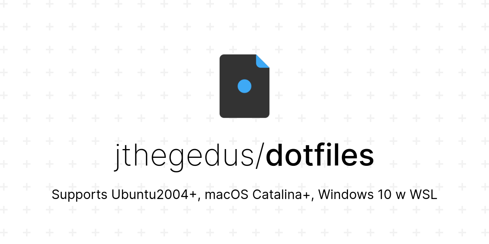

<div align="center">

# Dotfiles & Developer Environment 

Cross-platform dotfiles & developer environment for Ubuntu 20.04+ ([PopOS](https://pop.system76.com/)), macOS Catalina+ & Windows 10 with WSL2

⚡️ tools for shell superpowers ⚡️<br/>[asdf](https://github.com/asdf-vm/asdf) · [shellcheck](https://github.com/koalaman/shellcheck) · [navi](https://github.com/denisidoro/navi) · [thefuck](https://github.com/nvbn/thefuck) · [z](https://github.com/rupa/z)



</div>

## Contents

- [Contents](#contents)
- [Preamble](#preamble)
- [Windows 10 WSL2 Setup](#windows-10-wsl2-setup)
- [Ubuntu 20.04+ or macOS Catalina+](#ubuntu-2004-or-macos-catalina)
- [Ubuntu / PopOS Applications](#ubuntu--popos-applications)
- [VSCode](#vscode)
- [Fonts](#fonts)
- [Ubuntu on various hardware](#ubuntu-on-various-hardware)
- [Resources worth Reading](#resources-worth-reading)
- [Contributions](#contributions)
- [License](#license)

## Preamble

This "cross-platform" setup of mine is really just a Ubuntu 20.04+ ZSH environment. Homebrew is used on both Ubuntu and macOS where possible. Windows 10 is supported with Ubuntu 20.04+ via WSL 2 👌

## Windows 10 WSL2 Setup

<details>
<summary>Click to Expand for Windows Setup</summary>

### Enable WSL

1. press `windows key`
2. type `developer settings` & press `enter`
3. select `developer mode`
4. press `windows key`
5. type `turn windows features on or off` & press `enter`
6. check `Windows Subsystem for Linux` & then press `ok`
7. reboot

### Ubuntu 20.04 on Windows

Install the [Ubuntu 20.04 Shell](https://www.microsoft.com/en-us/p/ubuntu-2004-lts/9n6svws3rx71).

Boot the app and follow any instructions to setup your Ubuntu user profile.

Update Ubuntu deps with: `sudo apt-get update && sudo apt-get upgrade`

### Set WSL2 Version

In powershell (admin) set the WSL version for your Ubuntu shell:

```shell
# wsl --set-version <Distro> <Version>
wsl --set-version Ubuntu-20.04 2
```

Validate the correct WSL version is being used:

```shell
wsl --list --verbose
```

See the [development of WSL on GitHub](https://github.com/microsoft/WSL).

### Windows Terminal

Microsoft's new [Terminal application for Windows 10](https://www.microsoft.com/store/productId/9N0DX20HK701) is a modern terminal app with support for different shells, themes, tabs and unicode (read emoji) support.

See the [development of Terminal on GitHub](https://github.com/microsoft/terminal).

### VSCode with WSL 2

With VSCode's remote server feature, we now have native support for WSL within VSCode! Simply run `code .` from within a project folder in any terminal, if VSCode detects it needs to use WSL it will 💯 See the [docs for further information](https://code.visualstudio.com/docs/remote/wsl).

See the [VSCode remote server development on GitHub](https://github.com/microsoft/vscode-remote-release).

### Last Steps

Now that we have WSL 2 working and a Ubuntu 20.04 Bash shell we can essentially follow the below Ubuntu guide below ⬇️

</details>

## Ubuntu 20.04+ or macOS Catalina+

Items installed in the following scripts include:

- shell: [`zsh`](https://github.com/ohmyzsh/ohmyzsh/wiki/Installing-ZSH) · [`oh-my-zsh`](https://github.com/ohmyzsh/ohmyzsh) · [`powerline fonts`](https://github.com/powerline/fonts) · [`starship cross-shell theme`](https://starship.rs/)
- tools: [`asdf`](https://github.com/asdf-vm/asdf) · [`shellcheck`](https://github.com/koalaman/shellcheck) · [`navi`](https://github.com/denisidoro/navi) · [thefuck](https://github.com/nvbn/thefuck) · [`z`](https://github.com/rupa/z)
- tools with asdf: [`nodejs`](https://github.com/asdf-vm/asdf-nodejs) · [`deno`](https://github.com/asdf-community/asdf-deno) · [`firebase`](https://github.com/jthegedus/asdf-firebase) · [`gcloud`](https://github.com/jthegedus/asdf-gcloud) · [`hadolint`](https://github.com/looztra/asdf-hadolint) · [`python`](https://github.com/danhper/asdf-python) · [`shellcheck`](https://github.com/luizm/asdf-shellcheck) · [`terraform`](https://github.com/Banno/asdf-hashicorp)

and all system dependencies required by each of the above tools.

### Automated Installation

1. clone my dotfiles into the `projects` dir

   ```shell
   cd ~ && git clone https://github.com/jthegedus/dotfiles ~/projects/dotfiles
   ```

2. run the `setup-shell.bash` script. This script is interactive! (`exit` OMZSH shell once it is default. Then restart your shell.)

   ```shell
   ~/projects/dotfiles/scripts/setup-shell.bash
   ```

3. update `config/initial-asdf-plugins.txt` with the desired `asdf` plugins you wish to use. The defaults are listed at the beginning of this section.

4. run the `setup-devtools.bash` script

   ```shell
   ~/projects/dotfiles/scripts/setup-devtools.bash
   ```

5. restart your shell as required by `asdf`

6. run the `setup-devtools.bash` script again (The script accounts for re-running)

   ```shell
   ~/projects/dotfiles/scripts/setup-devtools.bash
   ```

### Automated Cleanup

- run the `cleanup.bash` script

```shell
~/projects/dotfiles/scripts/cleanup.bash
```

### Manual Installation

- open `scripts/setup-shell.bash` and `scripts/setup-devtools.bash` and copy/paste the commands you wish to use from top to bottom. It's fairly straight forward. If there is a tool you're unsure about either see my links at the top of the README or Google them 😉

## Ubuntu / PopOS Applications

I used to automate this process, but as time passes I reduce the tooling used to achieve particular tasks.

These are the system deps I use in Ubuntu/PopOS:

```shell
sudo apt install git curl tar apt-transport-https gnome-tweaks chrome-gnome-shell -y
```

I rely on PopOS for:

- tiling behaviour in Gnome as previous extensions I used were not as reliable
- Pop Shop to install VSCode `.deb`

Gnome Extensions:

- [Caffeine](https://extensions.gnome.org/extension/517/caffeine/): Disable the screensaver and auto suspend

## VSCode

Add VSCode to macOS path: https://code.visualstudio.com/docs/setup/mac#_launching-from-the-command-line

Choice extensions include:

- Settings Sync: [Now built into VSCode](https://code.visualstudio.com/docs/editor/settings-sync)!
- [shellcheck](https://marketplace.visualstudio.com/items?itemName=timonwong.shellcheck): static analysis your `.sh` scripts. Requires [shellcheck itself](https://github.com/koalaman/shellcheck#shellcheck---a-shell-script-static-analysis-tool).
- [shell format](https://github.com/foxundermoon/vs-shell-format): formats `.sh`, `.bash`, `Dockerfiles`, ignore files, amongst others.

## Fonts

- [Microsoft's Cascadia Code with Powerlines](https://github.com/microsoft/cascadia-code): mono, ligatures, free
- [JetBrains Mono](https://www.jetbrains.com/lp/mono/#how-to-install): mono, ligatures, free
- [Fira Code](https://github.com/tonsky/FiraCode): mono, ligatures, free
- [Dank Mono](https://dank.sh/): mono, ligatures, paid (although reasonable)
- [Hack](https://github.com/source-foundry/Hack): mono, free

## Ubuntu on various hardware

### Lenovo ThinkPad E485/E585

Ubuntu installation will hang on a Lenovo ThinkPad E485/E585. Below are the instructions I followed to remedy the issues:

- [18.04 / 18.10](https://medium.com/@jthegedus/ubuntu-18-04-lts-on-lenovo-thinkpad-e485-15e1d601473f)
- [19.04](https://medium.com/@jthegedus/ubuntu-19-04-lts-on-lenovo-thinkpad-e485-bf2d6cfd9cad)
- [19.04 - PopOS!](https://medium.com/@jthegedus/popos-19-04-on-lenovo-thinkpad-e485-ac3951199132)
- 20.04: it just works!
- PopOS (20.04+): it just works!

### Dell XPS15 9560

On login the OS may hang. Below are the instructions I followed to remedy the issues:

- [18.04 / 18.10](https://medium.com/@jthegedus/ubuntu-18-04-lts-on-a-dell-xps-db4dcee9a2f9)

## Resources worth Reading

ZSH:

- [Bash 2 ZSH reference card](http://www.bash2zsh.com/zsh_refcard/refcard.pdf): Bash user's guide to ZSH
- [ZSH Lovers](http://grml.org/zsh/zsh-lovers.html): Z Shell tips and tricks

## Contributions

Contributions of any kind welcome!

[Thanks goes to these contributors](https://github.com/jthegedus/dotfiles/graphs/contributors)!

### Why are there Node deps here?

I decided the value of [commitlint](https://commitlint.js.org/#/) & sharing Git Hooks with [husky](https://typicode.github.io/husky/#/) were greater than the cost of including these deps. Not only this, but dogfooding `asdf` for dev deps makes this less of an issue.

After clone, run `asdf install`, then `npm i` and you're good to go :)

## License

[MIT License](LICENSE) © [James Hegedus](https://github.com/jthegedus/)
